# DriveApp - Driver & Rider Mobile App

A full-stack ride-hailing application built with **Flutter** (frontend) and **Spring Boot** (backend), featuring real-time trip updates via **Pusher**.

## Screenshots

### Landing & Authentication
| Landing Page | Login Page |
|:---:|:---:|
| 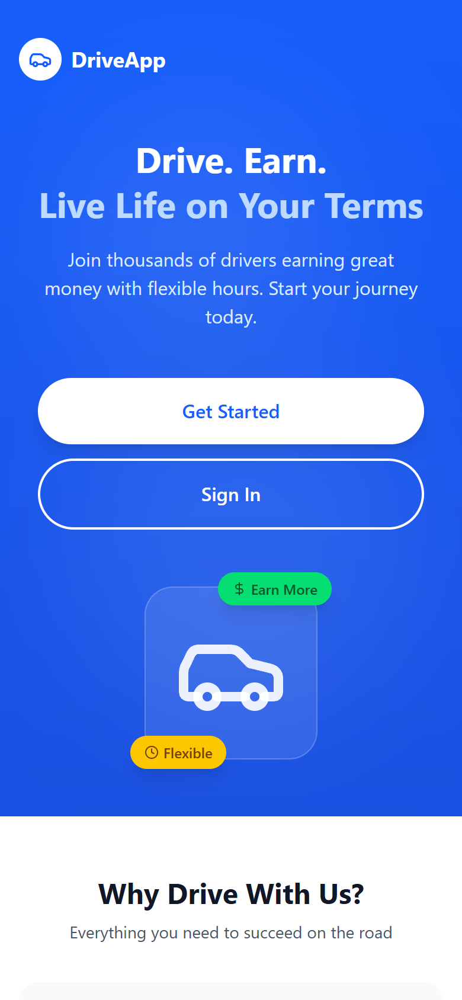 | 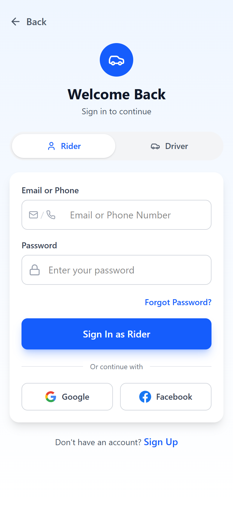 |

### Rider Screens
| Home | Search | History |
|:---:|:---:|:---:|
| 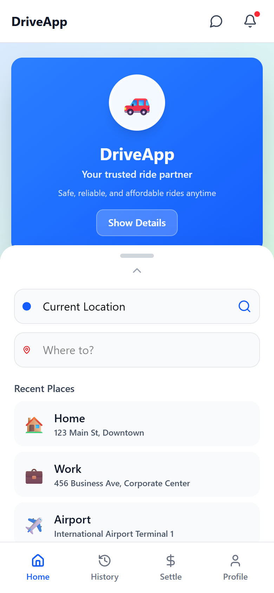 | 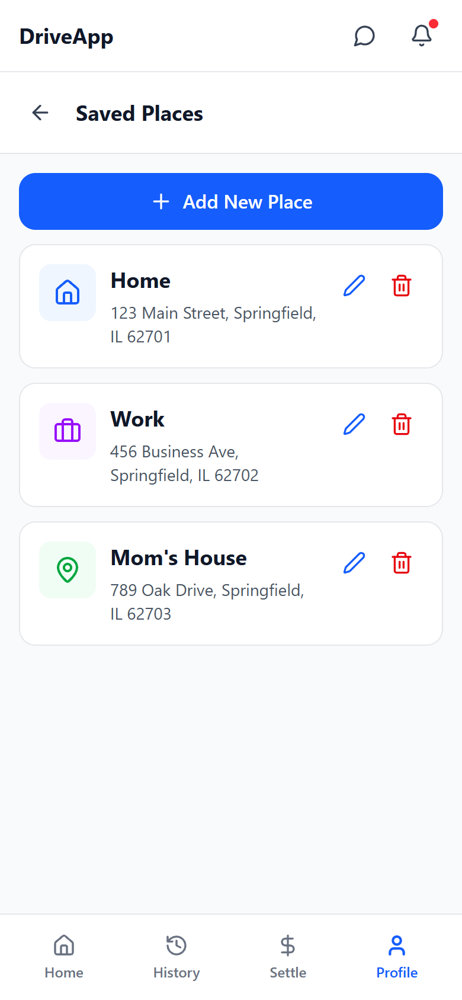 | 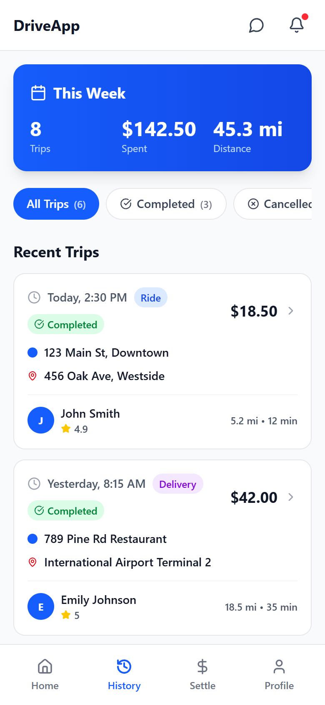 |

| Settle | Profile | Settings |
|:---:|:---:|:---:|
| 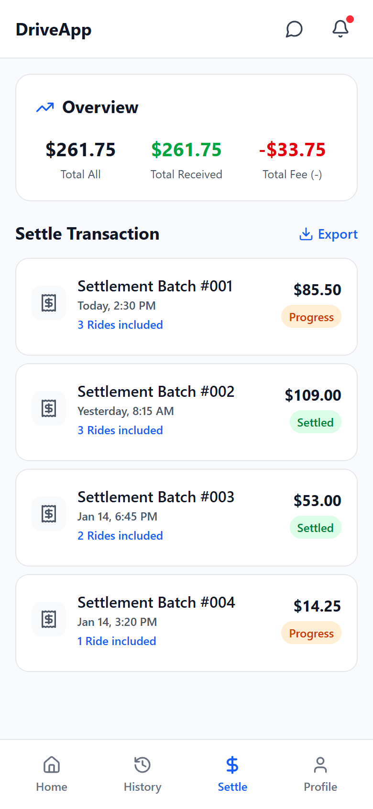 |  | 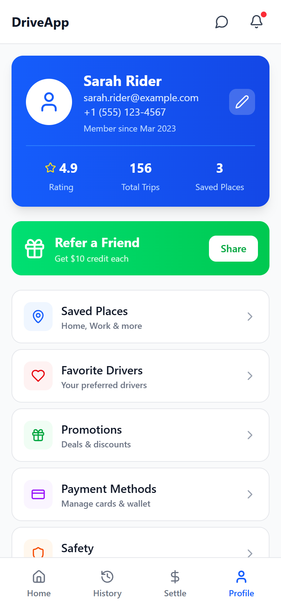 |

### Driver Screens
| Dashboard | Trips | Profile |
|:---:|:---:|:---:|
| 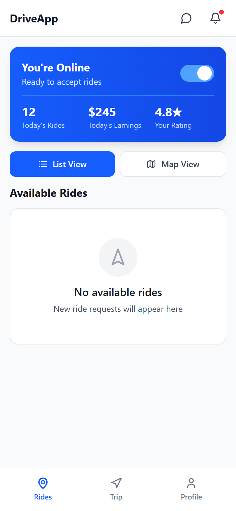 | 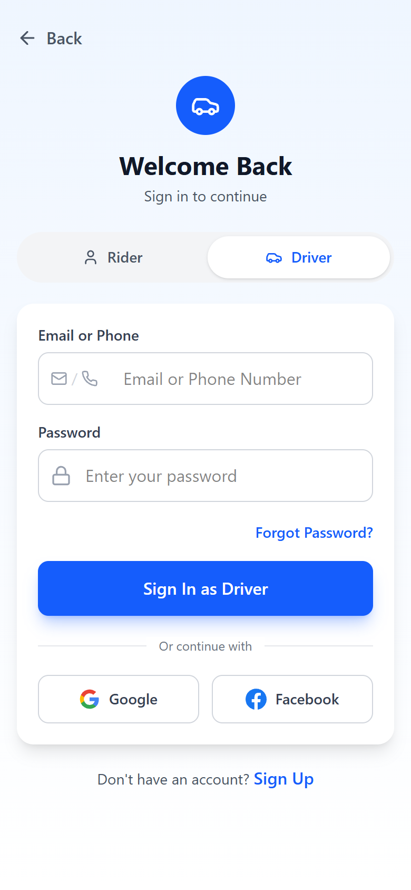 | 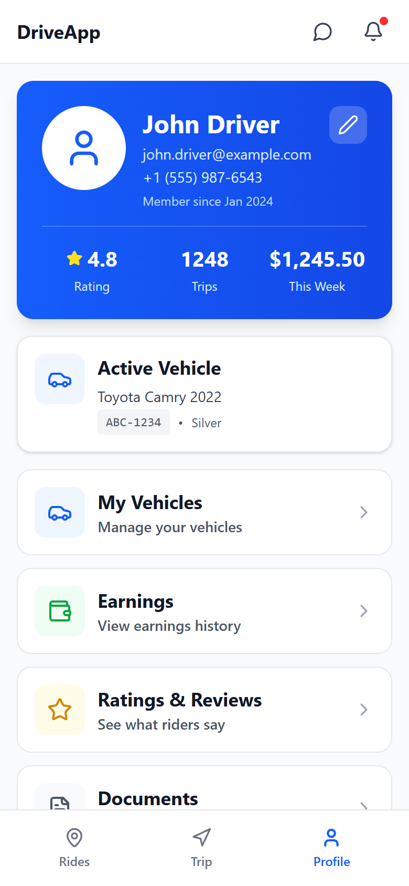 |

| Settings | Flutter Landing |
|:---:|:---:|
|  | 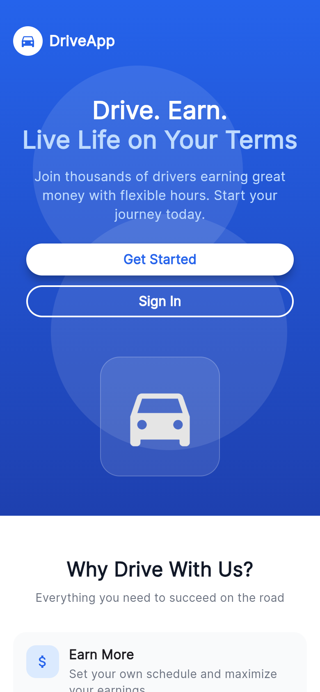 |

## Tech Stack

### Frontend (Flutter)
- **Flutter 3.x** with Dart
- **Riverpod** for state management
- **Pusher Channels** for real-time updates
- **Pusher Beams** for push notifications
- Screens: Landing, Login, Rider (Home, Ride Confirmation, Active Ride, History, Settle, Profile, Settings), Driver (Dashboard, Rides, Trips, Profile, Settings)

### Backend (Spring Boot)
- **Java 22** with Spring Boot 3.x
- **PostgreSQL** database
- **Flyway** for database migrations
- **Pusher Channels** for real-time event broadcasting
- RESTful API with CORS support

### Key Features
- Real-time trip acceptance via Pusher WebSocket
- Driver/Rider role-based authentication
- Trip lifecycle management (Request, Accept, Start, Complete, Cancel)
- In-app chat between driver and rider
- Payment settlement and history tracking
- Driver earnings and ratings
- COD (Cash on Delivery) support

## Project Structure

```
Driver and Rider/
├── backend-mvc/          # Spring Boot REST API
│   ├── src/main/java/com/driverandrider/
│   │   ├── controller/   # REST controllers
│   │   ├── model/        # JPA entities
│   │   ├── repository/   # Spring Data repos
│   │   ├── service/      # Business logic + Pusher
│   │   └── dto/          # Data transfer objects
│   └── src/main/resources/
│       └── db/migration/ # Flyway SQL migrations
├── frontend-app/
│   └── flutter/          # Flutter mobile app
│       └── lib/
│           ├── screens/  # UI pages (rider + driver)
│           ├── models/   # Data models
│           ├── providers/ # Riverpod state
│           ├── services/ # API + Realtime + Notifications
│           └── widgets/  # Reusable components
├── UI/                   # React reference UI (design source)
└── screenshots/          # App screenshots
```

## Getting Started

### Backend
```bash
cd backend-mvc
# Configure PostgreSQL in src/main/resources/application.properties
mvn spring-boot:run
```

### Flutter App
```bash
cd frontend-app/flutter
flutter pub get
flutter run -d chrome    # Web
flutter run              # Mobile device/emulator
```

## API Endpoints

| Method | Endpoint | Description |
|--------|----------|-------------|
| GET/POST | `/api/riders` | List/Create riders |
| GET/POST | `/api/drivers` | List/Create drivers |
| GET/POST | `/api/trips` | List/Create trips |
| PATCH | `/api/trips/{id}/accept` | Driver accepts trip |
| PATCH | `/api/trips/{id}/start` | Start trip |
| PATCH | `/api/trips/{id}/complete` | Complete trip |
| PATCH | `/api/trips/{id}/cancel` | Cancel trip |
| GET | `/api/payments` | List payments |
